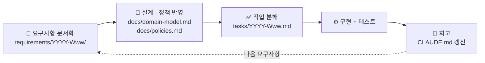
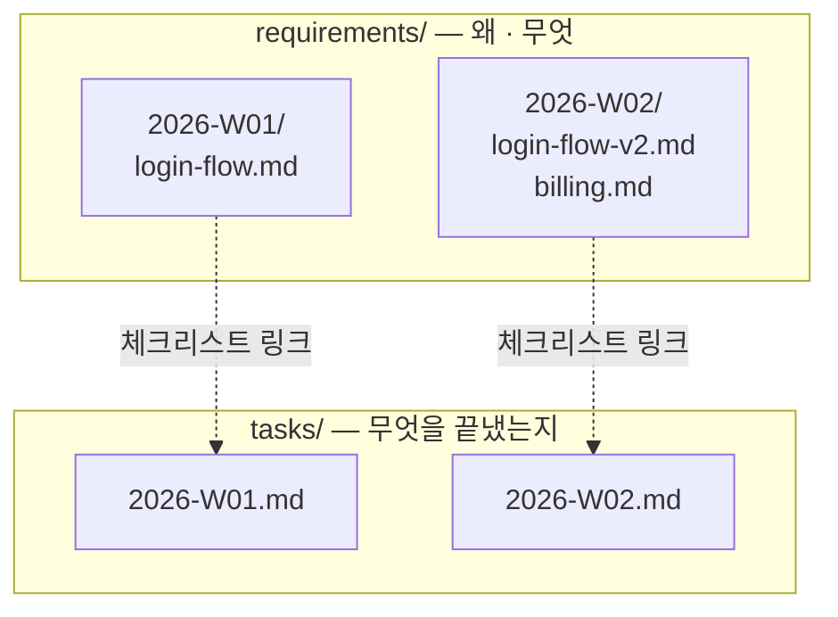

# my-workflow-init

요구사항 문서(`requirements/`)와 진행 체크리스트(`tasks/`)를 **ISO 주차(`YYYY-Www`) 단위**로 분리 관리하는 워크플로우를, 새 프로젝트에 그대로 부트스트랩하는 [Claude Code](https://claude.com/claude-code) 스킬입니다.

> 요구사항 문서화 → 설계/정책 반영 → 작업 분해 → 구현 → 회고. 이 흐름을 프로젝트마다 새로 설계하지 않고, 검증된 폴더 구조와 절차를 그대로 이식합니다.



## 설치

이 저장소의 내용을 프로젝트의 `.claude/skills/my-workflow-init/`에 그대로 복사(또는 서브모듈/clone)합니다.

```bash
git clone https://github.com/myeonnnn/my-workflow-init.git .claude/skills/my-workflow-init
rm -rf .claude/skills/my-workflow-init/.git
```

## 사용

Claude Code 세션에서 스킬을 호출합니다.

```
"요구사항 워크플로우 세팅해줘"
"이 워크플로우 이식해줘"
"requirements/tasks 구조 만들어줘"
```

### 세팅되는 것

| 산출물 | 내용 |
|---|---|
| `requirements/README.md` | ISO 주차 폴더 관례 설명 |
| `tasks/README.md` | ISO 주차 파일 관례 설명 |
| `docs/domain-model.md` | DDD 설계 스텁 (유비쿼터스 언어 · 바운디드 컨텍스트 · 애그리거트) |
| `docs/policies.md` | 확정 비즈니스 규칙 스텁 |
| `CLAUDE.md` | "새 요구사항 처리 절차" 섹션 (6단계 + 애드혹 예외 조항) |

기존 파일이 있으면 **덮어쓰지 않고** 먼저 확인합니다. 자세한 절차는 [`SKILL.md`](./SKILL.md)를 참고하세요.

## 왜 requirements/와 tasks/를 나누나요

같은 요구사항이라도 "왜/무엇을 하기로 했는가"(요구사항 문서)와 "무엇을 끝냈는가"(진행 체크리스트)는 성격이 다릅니다. 이 스킬은 둘을 별도 폴더로 분리하고, 같은 ISO 주차 키로 서로 링크합니다.



- **폴더/파일명**: `date +%G-W%V` 기준 `YYYY-Www`.
- 같은 주에 여러 요구사항이 들어와도 **하나로 합치지 않고** 문서만 늘어납니다.
- 문서화되지 않은 애드혹 요청(인프라/리팩터링/스타일링 등)은 `tasks/YYYY-Www.md`의 "요구사항 문서 없음" 섹션에 바로 기록합니다.

## 참고

- [`SKILL.md`](./SKILL.md) — 스킬이 따르는 상세 절차와 예외 조항
- [`templates/`](./templates) — 실제로 복사되는 산출물 원본 (즉석 재작성 없음)
