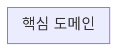

# 도메인 모델 (DDD)

요구사항 문서 기반의 전략적/전술적 설계 초안. 로직 구현 전, 애그리거트 경계와 컨텍스트 관계를 먼저 정리한다. 비즈니스 정책/규칙은 [docs/policies.md](./policies.md)에 별도로 정리한다.

## 1. 유비쿼터스 언어

| 용어 | 의미 |
|---|---|
| | |

## 2. 바운디드 컨텍스트

## 3. 애그리거트 설계

## 4. 리포지토리 경계

## 5. 도메인 이벤트 (최소 초안)

## 6. Read Model (애그리거트 외부, 조회 전용)
